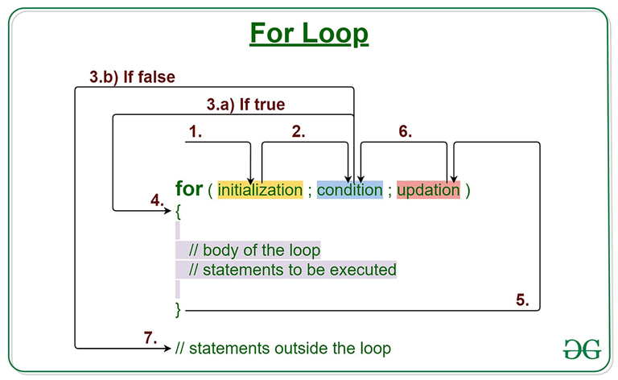
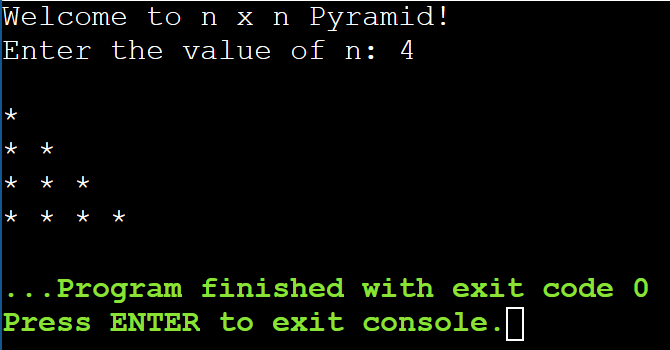

# Lab Assignment 10

In this lab you will practice working with for loops.

Same as the previous labs, you need to set up your workspace (class and main() method).

## Let's get started!

First, let's look at the name of our .java file in the `src/` directory and name your class accordingly and remember to make it `public`. Next, **create your main() method inside your class**.

Now let's begin!

### For Loops

Loops in Java are exactly the same as in C++.

For loos are used when you know exactly how many times you want your code block to execute.

Same as the while loops, for loops can utilize `break` and `continue` statements.

For more information on for loops in Java visit: https://www.w3schools.com/java/java_for_loop.asp

## Your Assignment

### Print a *n* x *n* Pyramid

For this assignment you will need to create *nested for loops* to print a `n`x`n` pyramid.

Prompt the user to input `n`, the height and length of your pyramid.

**Suggested Output:**

## Submit your assignment

[Grading Criteria](https://joselitoguardado.dev/3326/labs/Lab_10.pdf)

[How to Submit Assignments to GitHub](https://joselitoguardado.dev/3326/How_to_Submit_Assignments_to_GitHub.pdf)
